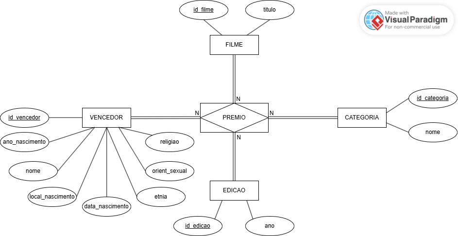
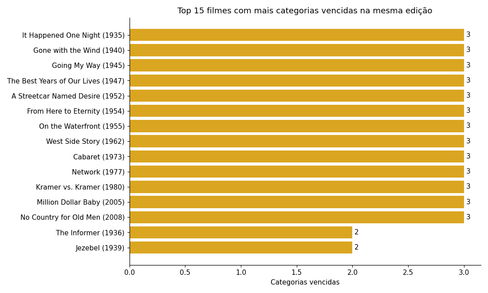
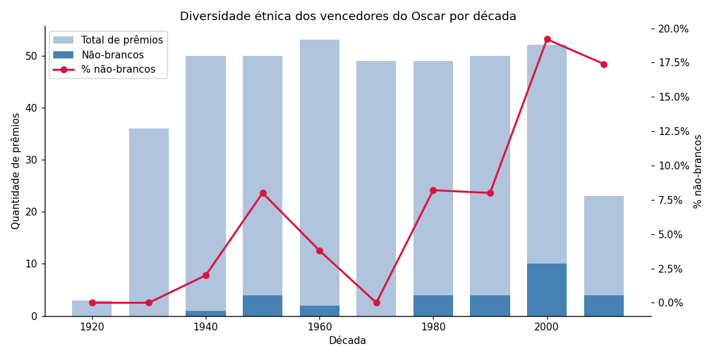
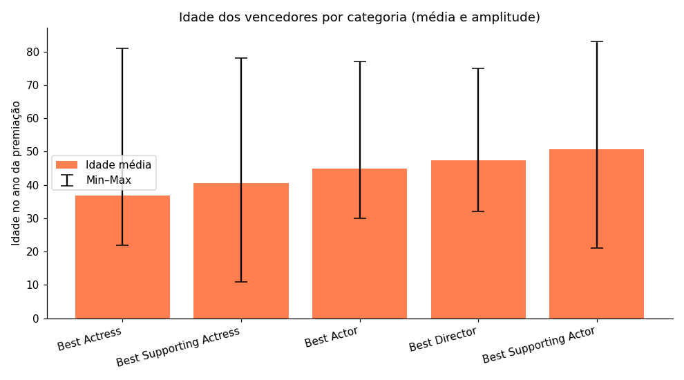
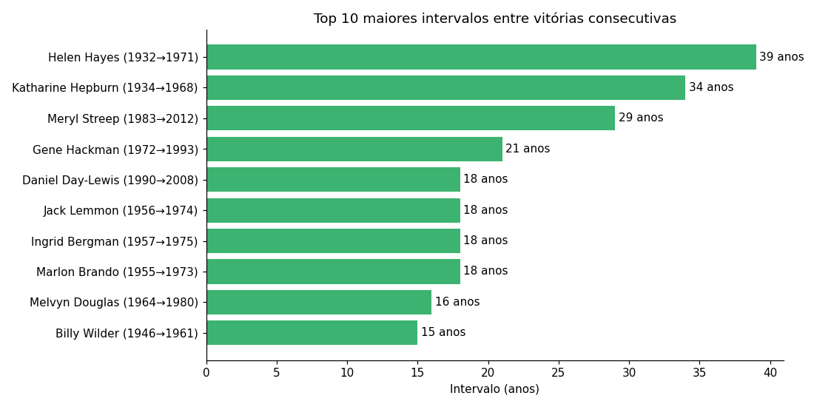
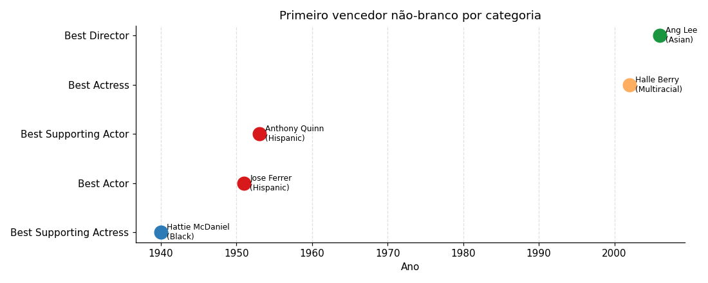

---
output:
  pdf_document:
    latex_engine: xelatex
  html_document: default
---
# Relatório — Projeto Final de Banco de Dados
**Disciplina:** Banco de Dados — DCC/UFMG  
**Professor:** Pedro H. Barros  
**Dataset:** Oscar AMPAS — Winner Demographics (1927–2014)

**Grupo:**

1. Lucas Samuel Fernandes Andrade Oliveira,
2. Felipe Ribas Muniz,
3. Iury Alves Bicalho e
4. Bruno dos Santos Lopes

---

## 1. Introdução

Este projeto implementa o ciclo completo de um banco de dados relacional sobre os vencedores do Oscar (Academy Awards), premiação anual da Academia de Artes e Ciências Cinematográficas dos Estados Unidos (AMPAS). O dataset contém informações demográficas de vencedores de cinco categorias principais entre 1927 e 2014, permitindo análises sobre representatividade étnica, longevidade de carreira e domínio artístico ao longo de quase nove décadas de cinema.

As etapas de um projeto de banco de dados desenvolvidas partem do projeto conceitual Entidade-Relacionamento, que é depois convertido num modelo Relacional e testado sobre as premissas das 3 formas normais. Os modelos projetados são então implementados em SQL por meio da Data Definition language (DDL) e a base de dados resultante é populada com o arquivo csv. Antes de se executar as análises e consultas SQL, um tratamento é feito, seguido da análise exploratópria dos dados.

### Motivação
O Oscar é a premiação cinematográfica mais influente do mundo. Analisar o perfil dos vencedores ao longo do tempo revela padrões históricos de diversidade na indústria do cinema.

---

## 2. Dataset

A base de dados utilizada, "World Oscar AMPAS winner demographics", contém dados a respeito das categorias: Melhor Atriz, Melhor Ator, Melhor Diretor, Melhor Ator Coadjuvante, Melhor Atriz Coadjuvante, para as edições da premiação que ocorreram entre 1927 e 2014. Os atributos do dataset e a relação das variáveis presentes está mostrada na tabela a seguir:

| Atributo | Valor |
|---|---|
| Fonte | FiveThirtyEight / AMPAS |
| Arquivo | `world_ampas_oscar_winner_demographics.csv` |
| Linhas | 415 |
| Colunas | 10 |
| Período | 1927 a 2014 |

### Colunas originais

| Coluna | Tipo | Descrição |
|---|---|---|
| name | texto | Nome do vencedor |
| birth_year | inteiro | Ano de nascimento |
| birth_date | data | Data de nascimento |
| birthplace | texto | Local de nascimento (texto livre) |
| race_ethnicity | texto | Etnia (6 valores: White, Black, Hispanic, Asian, Multiracial, Middle Eastern) |
| religion | texto | Religião |
| sexual_orientation | texto | Orientação sexual |
| year_edition | inteiro | Ano da cerimônia |
| category | texto | Categoria do Oscar (5 categorias: Melhor Atriz, Melhor Ator, Melhor Diretor, Melhor Ator Coadjuvante, Melhor Atriz Coadjuvante) |
| movie | texto | Filme premiado |

### Tratamento de dados ausentes
Foram realizadas os seguintes tratamentos na base original importada:

- `religion`: Tratado como `NULL` para valores ausentes.
- `sexual_orientation`: string `"Na"` convertida para `NULL` na carga.
- `birth_date`: 1 registro ausente; `birth_year` mantido para não perder informação.

---

## 3. Etapa 1: Modelo Entidade-Relacionamento

### Entidades

| Entidade | Atributos | Chave |
|---|---|---|
| VENCEDOR | nome, ano_nascimento, data_nascimento, local_nascimento, etnia, religiao, orient_sexual | id_vencedor |
| FILME | titulo | id_filme |
| CATEGORIA | nome | id_categoria |
| EDICAO | ano | id_edicao |
| PREMIO | id_vencedor, id_filme, id_categoria, id_edicao | id_premio |

### Relacionamentos

O projeto para o banco de dados considerou a criação de `PREMIO`, que é uma **entidade associativa** que conecta as quatro demais entidades. `PREMIO` permite que VENCEDOR, FILME, EDICAO e CATEGORIA se relacionem diretamente, de forma que caracterizem uma entrada na base de dados, ou seja, cada `PREMIO` corresponde a uma das categorias do Oscar em determinada edição, da qual houve um vencedor por causa de determinado filme.

Nessa estruturação, é obrigatório que cada uma dessas 4 entidades possuam uma respectiva entrada nas demais 3 que se associem a ela, caracterizando uma participação total. A entidade associativa caracteriza um relacionamento M:N.


### Diagrama ER

O diagrama a seguir representa o esquemático da modelagem apresentada anteriormente, com as entidades, relacionamentos representados pela notação clássica.




### Restrições de integridade de domínio

**VENCEDOR**

`id_vencedor` (Chave):
- Tipo: Numérico Inteiro (ex: INT).
- Restrição: Único, NOT NULL

`nome`:
- Tipo: Texto.
- Restrição: NOT NULL.

`ano_nascimento`:
- Tipo: Numérico Inteiro.
- Restrição: Positivo, pode aceitar nulos (NULL).

`local_nascimento`:
- Tipo: Composto {cidade, estado, país}
- Restrição: para cada atributo, texto livre, podem aceitar nulos (NULL).

`etnia`:
- Tipo: Texto.
- Restrição: NOT NULL.

`religiao`:
- Tipo: Texto.
- Restrição: Pode aceitar nulos (NULL).

`orient_sexual`:
- Tipo: Texto.
- Restrição: Aceita nulos (NULL). Valores identificados como "Na" no sistema de origem devem ser convertidos e tratados formalmente como NULL no banco de dados.

**FILME**

`id_filme` (Chave):
- Tipo: Numérico Inteiro.
- Restrição: Único, NOT NULL.

`titulo`:
- Tipo: Texto.

**CATEGORIA**

`id_categoria` (Chave):
- Tipo: Numérico Inteiro.
- Restrição: Único, NOT NULL.

`nome`:
- Tipo: Texto.
- Restrição: NOT NULL.

**EDICAO**

`id_edicao` (Chave):
- Tipo: Numérico Inteiro.
- Restrição: Único, NOT NULL.

`ano`:
- Tipo: Numérico Inteiro.
- Restrição: O ano deve ser maior ou igual a 1927 (ano inicial da premiação no dataset).

**PREMIO**

`id_premio` (Chave):
- Tipo: Numérico Inteiro.
- Restrição: Único, NOT NULL.

`id_vencedor`:
- Tipo: Numérico Inteiro.

`id_filme`:
- Tipo: Numérico Inteiro.

`id_categoria`:
- Tipo: Numérico Inteiro.

`id_edicao`:
- Tipo: Numérico Inteiro.

---

## 4. Etapa 2: Modelo Relacional

A modelagem Entidade-Relacionamento anterior permitiu uma abordagem bem direta para a modelagem Relacional, cada entidade se tornou 1 tabela relação, a entidade associativa formou uma tabela associativa da relação M:N, constituindo-se das chaves primárias de cada uma das outras relações como chaves estrangeiras.

```
vencedor(id_vencedor PK, nome, ano_nascimento, data_nascimento,
         local_nascimento, etnia, religiao, orient_sexual)

filme(id_filme PK, titulo)

categoria(id_categoria PK, nome)

edicao(id_edicao PK, ano)

premio(id_premio PK,
       id_vencedor FK > vencedor,
       id_filme    FK > filme,
       id_categoria FK > categoria,
       id_edicao   FK > edicao)
```

### Normalização

O processo de normalização para a base de dados escolhida se deu de maneira mais simples, por se tratar de uma base de dados com poucas colunas. As avaliações para cada forma normal para as tabelas modeladas anteriormente se da da seguinte maneira:

**1FN:** a tabela `VENCEDOR` contém um atributo composto `local_nascimento`. Como as informações de estado e cidade não seriam de interesse, elas foram descartadas e o atributo composto foi transofrmado em uma chave estrangeira que referencia uma nova tabela para o país de nascimento, com o intuito de garantir consistência no nome dos países.

**2FN:** todas as tabelas têm chave primária simples, portanto dependências parciais são impossíveis;

**3FN:** o único caso observado foi `ano_nascimento` e `data_nascimento` na tabela `VENCEDOR`. Optou-se por manter `birth_year`, removendo `birth_date` da tabela, já que `birth_year` estava completa para todas as entradas. Não há dependências transitivas nas demais tabelas.

Também para padronizar e garantir consistência, as variáveis etnia, religiao e orient_sexual foram transformadas em chaves estrangeiras para novas tabelas com as respectivas informações. O esquema resultante é mostrado na tabela a seguir:


```
vencedor(id_vencedor PK, nome, ano_nascimento, data_nascimento,
         pais_nascimento FK > pais, 
         etnia FK > etnia,
         religiao FK > religiao,
         orient_sexual FK > orient_sexual)

filme(id_filme PK, titulo)

categoria(id_categoria PK, nome)

edicao(id_edicao PK, ano)

pais(nome_pais PK)

etnia(nome_etnia PK)

religiao(nome_religiao PK)

orient_sexual(nome_orient_sexual PK)

premio(id_premio PK,
       id_vencedor FK > vencedor,
       id_filme    FK > filme,
       id_categoria FK > categoria,
       id_edicao   FK > edicao)
```

---

## 5. Etapa 3: Implementação Física

A definição das tabelas do esquema relacional (DDL) e a validação dos dados e  foi feita em SQL (arquivos `Etapa3_SQL/01_ddl_criar_tabelas.sql` e `Etapa3_SQL/03_validacao_cargas.sql`, respectivamente).

### Banco de dados
- **SGBD:** PostgreSQL 16 (via Docker)
- **Container:** `oscar-db`
- **Banco:** `oscar`

### Restrições implementadas

| Restrição | Tipo | Tabela |
|---|---|---|
| `id_*` únicos e não nulos | Chave primária | Todas |
| `nome` NOT NULL | Entidade | vencedor, filme, categoria |
| `ano >= 1927` | Domínio | edicao |
| ano_nascimento = YEAR(data_nascimento) | Consistência | Vencedor |
| FKs referenciam registros existentes | Referencial | premio |
| `(id_vencedor, id_categoria, id_edicao)` único | Negócio | premio |

### Índices criados
```sql
CREATE INDEX idx_premio_vencedor  ON premio(id_vencedor);
CREATE INDEX idx_premio_filme     ON premio(id_filme);
CREATE INDEX idx_premio_categoria ON premio(id_categoria);
CREATE INDEX idx_premio_edicao    ON premio(id_edicao);
```

---

## 6. Etapa 3: Carga dos Dados

Pipeline em Python (`Etapa3_SQL/02_carga_dados.py`) usando `psycopg2`.

**Ordem de inserção:**
1. `edicao` — 87 cerimônias
2. `categoria` — 5 categorias
3. `filme` — 335 títulos únicos
4. `vencedor` — 348 pessoas únicas (deduplicadas por nome)
5. `premio` — 415 registros (um por linha do CSV)

**Validação pós-carga:**
- Zero registros órfãos em todas as FKs
- Nenhuma duplicata na restrição de negócio de `PREMIO`.
- NULLs distribuídos como esperado (`religion`: 219, `orient_sexual`: 10)

---

## 7. Etapa 4: Análise Exploratória

Com o banco populado, formulamos perguntas que exploram padrões históricos de diversidade, prestígio e longevidade de carreira entre os vencedores do Oscar (1927–2014). As consultas completas estão nos arquivos `Etapa4_EDA/p*.sql`.

### P1 — Quais filmes venceram mais de uma categoria na mesma cerimônia?
A Figura *"Top 15 filmes com mais categorias vencidas na mesma edição"* revela que 13 filmes no total receberam 3 das 5 categorias do Oscar na mesma cerimônia, considerando a extensão temporal da base de dados. 60 filmes no total venceram 2 ou mais categorias, o mais recente sendo Dallas Buyers Club (2014). Os filmes da Figura estão organados pelo ano de premiação.

```sql
SELECT
    f.titulo,
    e.ano,
    COUNT(*)                                            AS categorias_vencidas,
    STRING_AGG(c.nome, ', ' ORDER BY c.nome)           AS quais_categorias
FROM premio p
JOIN filme    f ON f.id_filme     = p.id_filme
JOIN edicao   e ON e.id_edicao    = p.id_edicao
JOIN categoria c ON c.id_categoria = p.id_categoria
GROUP BY f.titulo, e.ano
HAVING COUNT(*) > 1
ORDER BY categorias_vencidas DESC, e.ano;
```



### P2 — Como a proporção de vencedores não-brancos mudou ao longo das décadas?
Até os anos 1970, a proporção de vencedores não-brancos foi praticamente zero, atingindo no máximo cerca de 7% na década de 1950. A partir dos anos 2000, subiu para cerca de 19%, ainda longe de representar a diversidade da população americana. A Figura *"Diversidade étnica dos vencedores do Oscar por década"* mostra a variação da proporção entre brancos e não-brancos ao decorrer das décadas, o eixo esquerdo e as barras se referem aos valores absolutos, enquanto a linha vermelha e o eixo direito se referem ao valor percentual.

```sql
SELECT
    (e.ano / 10) * 10                                           AS decada,
    COUNT(*)                                                    AS total_premios,
    COUNT(*) FILTER (WHERE v.etnia <> 'White')                  AS nao_brancos,
    ROUND(
        COUNT(*) FILTER (WHERE v.etnia <> 'White') * 100.0
        / COUNT(*), 1
    )                                                           AS pct_nao_brancos
FROM premio p
JOIN vencedor v ON v.id_vencedor = p.id_vencedor
JOIN edicao   e ON e.id_edicao   = p.id_edicao
GROUP BY decada
ORDER BY decada;
```



### P3 — Qual a idade média dos vencedores por categoria? Quem ganhou mais jovem e mais velho?
Atrizes vencem mais jovens (média 37 anos), a mais jovem foi Tatum O'Neal com 11 anos (Paper Moon, 1974) e a mais velha foi Peggy Ashcroft (A Passage to India, 1985) com 78 anos. Entretanto, atores coadjuvantes vencem mais velhos (média 51), o mais velho foi Christopher Plummer com 83 anos (Beginning, 2012) e o mais jovem foi Timothy Hutton (Oridnary People, 1981) com 21 anos. A Figura *"Idade dos vencedores por categoria (média e amplitude)"* mostra um gráfico com barras indicando o valor médio das idades em cada categoria, enquanto as linhas verticais delimitam o mínimo e o máximo de cada uma, respectivamente.

```sql
SELECT
    c.nome                                          AS categoria,
    ROUND(AVG(e.ano - v.ano_nascimento), 1)         AS idade_media,
    MIN(e.ano - v.ano_nascimento)                   AS mais_jovem,
    MAX(e.ano - v.ano_nascimento)                   AS mais_velho
FROM premio p
JOIN vencedor  v ON v.id_vencedor  = p.id_vencedor
JOIN edicao    e ON e.id_edicao    = p.id_edicao
JOIN categoria c ON c.id_categoria = p.id_categoria
WHERE v.ano_nascimento IS NOT NULL
GROUP BY c.nome
ORDER BY idade_media;

```

```sql
(
    SELECT v.nome, c.nome AS categoria, e.ano,
           (e.ano - v.ano_nascimento) AS idade, 'mais jovem' AS tipo
    FROM premio p
    JOIN vencedor  v ON v.id_vencedor  = p.id_vencedor
    JOIN edicao    e ON e.id_edicao    = p.id_edicao
    JOIN categoria c ON c.id_categoria = p.id_categoria
    WHERE v.ano_nascimento IS NOT NULL
    ORDER BY idade ASC
    LIMIT 5
)
UNION ALL
(
    SELECT v.nome, c.nome, e.ano,
           (e.ano - v.ano_nascimento), 'mais velho'
    FROM premio p
    JOIN vencedor  v ON v.id_vencedor  = p.id_vencedor
    JOIN edicao    e ON e.id_edicao    = p.id_edicao
    JOIN categoria c ON c.id_categoria = p.id_categoria
    WHERE v.ano_nascimento IS NOT NULL
    ORDER BY (e.ano - v.ano_nascimento) DESC
    LIMIT 5
)
ORDER BY tipo, idade;
```



### P4 — Entre quem ganhou mais de um Oscar, qual foi o maior intervalo de anos entre as vitórias?
Helen Hayes esperou 39 anos entre seu primeiro (1932) e segundo Oscar (1971), o maior intervalo registrado. Katharine Hepburn esperou 34 anos (1934–1968) e Meryl Streep esperou 29 anos (1983-2012). A Figura *"Top 10 maiores intervalos entre vitórias consecutivas"* mostra os 10 vencedores de Oscars com maiores intervalos entre premiações.

```sql
WITH vitorias_ordenadas AS (
    SELECT
        v.nome,
        e.ano,
        LAG(e.ano) OVER (PARTITION BY v.id_vencedor ORDER BY e.ano) AS ano_anterior
    FROM premio p
    JOIN vencedor v ON v.id_vencedor = p.id_vencedor
    JOIN edicao   e ON e.id_edicao   = p.id_edicao
)
SELECT
    nome,
    ano_anterior  AS primeiro_oscar,
    ano           AS segundo_oscar,
    (ano - ano_anterior) AS intervalo_anos
FROM vitorias_ordenadas
WHERE ano_anterior IS NOT NULL
ORDER BY intervalo_anos DESC
LIMIT 10;
```



### P5 — Em que ano cada categoria teve seu primeiro vencedor não-branco?
A primeira categoria a contemplar um não-branco foi a de Melhor Atriz Coadjuvante, com Hattie McDaniel (Gone with the Wind, 1940), uma atriz negra. Após isso, demorou 11 anos até que Jose Ferrer entrasse como primeiro vencedor não-branco da categoria Melhor Ator (Cyrano de Bergerac, 1951).

```sql
WITH ranking AS (
    SELECT
        c.nome                                              AS categoria,
        v.nome                                              AS vencedor,
        v.etnia,
        e.ano,
        ROW_NUMBER() OVER (PARTITION BY c.id_categoria ORDER BY e.ano) AS rn
    FROM premio p
    JOIN vencedor  v ON v.id_vencedor  = p.id_vencedor
    JOIN edicao    e ON e.id_edicao    = p.id_edicao
    JOIN categoria c ON c.id_categoria = p.id_categoria
    WHERE v.etnia <> 'White'
)
SELECT categoria, vencedor, etnia, ano AS primeiro_ano_nao_branco
FROM ranking
WHERE rn = 1
ORDER BY primeiro_ano_nao_branco;
```

| Categoria | Vencedor | Etnia | Ano |
|---|---|---|---|
| Best Supporting Actress | Hattie McDaniel | Black | 1940 |
| Best Actor | Jose Ferrer | Hispanic | 1951 |
| Best Supporting Actor | Anthony Quinn | Hispanic | 1953 |
| Best Actress | Halle Berry | Multiracial | 2002 |
| Best Director | Ang Lee | Asian | 2006 |



---

## 8. Conclusão

O projeto permitiu implementar todas as etapas do ciclo de vida de um banco de dados relacional: modelagem ER com aplicação de conceitos como a entidade associativ, mapeamento relacional e verificação de normalidade até a terceira forma normal, implementação DDL com restrições de integridade, carga dos dados e análise exploratória via SQL, além da criação de visualizações utilizando *python*.

Os dados revelam que a Academia de Artes e Ciências Cinematográficas demorou décadas para reconhecer artistas não-brancos, com a primeira vitória não-branca em Melhor Diretor ocorrendo apenas em 2006 — quase 80 anos após a primeira cerimônia, mas que existe uma tendência de crescimento nas últimas décadas.
